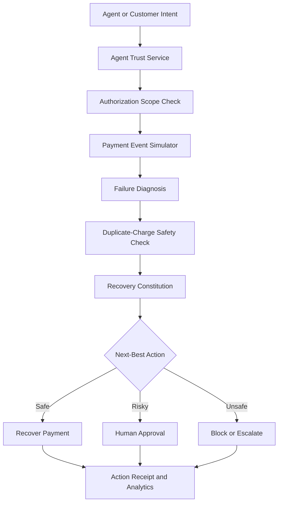

✦ RecoverAI
============

**Recover revenue. Protect trust. Enable autonomous checkout.**

<p align="center">
  <strong>A trust-aware control layer for AI-agent-initiated payments</strong><br />
  Verify the agent. Enforce the scope. Recover the safe payment. Block the unsafe one.
</p>

<p align="center">
  
  
  
</p>

<p align="center">
  <a href="#-live-demo-story">Live Demo Story</a> ·
  <a href="#-why-recoverai">Why RecoverAI?</a> ·
  <a href="#-architecture">Architecture</a> ·
  <a href="#-quick-start">Quick Start</a>
</p>

RecoverAI is an independent prototype for the Razorpay Internship Application. It is not an official Razorpay product and uses synthetic payment, customer, merchant, and agent data.

---

## ⚡ The Idea in 30 Seconds

AI agents will soon search, choose, and pay on behalf of people. But when an agent initiates a checkout, merchants need more than a payment button — they need trust, authorization, safety, and explainability.

RecoverAI sits between agent intent and payment execution. It answers four questions before allowing an action:

1. Who initiated this payment?
2. What was the agent authorized to do?
3. Is the current request still within the original intent?
4. Is it safe to recover, approve, or retry this payment?

**RecoverAI helps safe autonomous purchases complete while stopping unsafe autonomous actions.**

---

## ✨ Why RecoverAI?

| Traditional checkout | RecoverAI |
|---|---|
| Sees a payment request | Understands the agent, customer, amount, category, and intent |
| Treats every retry similarly | Chooses the safest next-best action |
| Does not understand agent permissions | Enforces transaction, category, and daily spending limits |
| May retry during uncertain payment states | Checks duplicate-charge and delayed-webhook risk first |
| Detects problems after the fact | Blocks intent drift before execution |
| Gives limited context to operators | Provides confidence, reasoning, safeguards, and receipts |

---

## 🎬 Live Demo Story

### TravelMate-204: a safe purchase that becomes an unsafe one

| Signal | Value |
|---|---|
| Agent | TravelMate-204 |
| Customer | Customer T-204 |
| Purchase intent | Weekend hotel booking |
| Authorized category | Hotels & Travel |
| Original amount | ₹9,800 |
| Maximum authorized amount | ₹12,000 |
| Payment rail | UPI |
| Agent trust score | 88/100 |

### The flow

```
① Agent initiates ₹9,800 hotel checkout
                    ↓
② RecoverAI verifies identity and authorization scope
                    ↓
③ UPI timeout occurs — no blind retry
                    ↓
④ Duplicate-charge risk is checked: 4%
                    ↓
⑤ Alternate UPI recovery link is prepared
                    ↓
⑥ Agent changes the request to ₹18,000
                    ↓
⑦ RecoverAI detects intent drift and blocks the overrun
                    ↓
⑧ Human approval is requested
```

### The safety moment

```
┌─────────────────────────────────────────────┐
│           AGENT CHECKOUT BLOCKED             │
├─────────────────────────────────────────────┤
│ Original amount        ₹9,800                │
│ Requested amount       ₹18,000               │
│ Authorized maximum     ₹12,000               │
│ Amount over limit      ₹6,000                │
│                                               │
│ Reason: Request exceeds authorization scope  │
│ Action: Human approval required              │
└─────────────────────────────────────────────┘
```

---

## 💰 Two Outcomes, Clearly Separated

RecoverAI distinguishes between recovering a safe payment and blocking an unsafe action.

### ✅ Safe recovery

A temporary UPI timeout is recovered through an alternate payment link:

| Field | Value |
|---|---|
| Payment status | RECOVERED |
| Recovered revenue | ₹9,800 |
| Recovery action | Alternate UPI payment link |
| Retries avoided | 1 |
| Duplicate risk | 4% |

### 🛡️ Scope protection

An AI agent attempts to exceed its authorization:

| Field | Value |
|---|---|
| Payment status | BLOCKED_BY_SCOPE |
| Recovered revenue | ₹0 |
| Requested amount | ₹18,000 |
| Maximum allowed | ₹12,000 |
| Human approval | Required |
| Reason | Amount exceeds authorization scope |

---

## 🧠 Trust-Aware Recovery Engine

RecoverAI does not treat every failed payment as a retry opportunity.

| Payment event | Decision |
|---|---|
| Temporary UPI timeout | Check debit status, wait, then offer an alternate link |
| Expired card | Request a new payment method; never retry the same card |
| Insufficient balance | Send one respectful reminder; avoid repeated retries |
| Bank outage | Pause recovery and suggest another payment rail |
| Delayed webhook | Reconcile payment status before contacting or retrying |
| Duplicate debit signal | Block retry and escalate for reconciliation |
| Abandoned checkout | Allow at most one contextual reminder |
| High-value payment | Require human approval |
| Agent amount overrun | Block the transaction and request approval |

---

## 🔒 Five-Point Payment Safety Check

Before a recovery action is allowed, RecoverAI evaluates:

- ✓ No successful debit signal detected
- ✓ No pending bank confirmation
- ✓ No unresolved delayed webhook
- ✓ No recent retry inside the safety interval
- ✓ Idempotency and refund flags checked

If the risk is too high, the system pauses recovery instead of risking a duplicate charge.

---

## 🧾 Agent Action Receipt

Every final action produces an explainable audit receipt.

```
┌─────────────────────────────────────────────┐
│           RECOVERAI · ACTION RECEIPT         │
├─────────────────────────────────────────────┤
│ Case                 REC-10482               │
│ Agent                TravelMate-204          │
│ Original amount      ₹9,800                  │
│ Recovered revenue    ₹9,800                  │
│ Outcome              RECOVERED               │
│ Decision confidence  93%                     │
│ Retries avoided      1                       │
│ Safeguard            Duplicate check passed  │
└─────────────────────────────────────────────┘
```

Receipts can be exported as JSON for audit, debugging, and future reconciliation workflows.

---

## ⚙️ Recovery Constitution

Merchants define what the agent may do automatically and when a human must intervene.

| Policy control | Example value |
|---|---|
| Maximum automatic recovery | ₹10,000 |
| Maximum agent transaction | ₹12,000 |
| Daily agent spending limit | ₹30,000 |
| Maximum attempts per case | 2 |
| Duplicate-risk threshold | 20% |
| Minimum confidence | 70% |
| Human-approval threshold | ₹25,000 |
| Maximum cart modification | 15% |
| Customer messages per day | 2 |

**Autonomy modes**

```
Observe only  →  Recommend  →  Prepare  →  Act within policy
```

Policy changes directly affect the simulated decision engine.

---

## 🏗️ Architecture



### Core services

```
src/services/
├── AgentTrustService.ts
├── AuthorizationScopeService.ts
├── AgentCheckoutService.ts
├── RecoveryDecisionEngine.ts
├── DuplicateChargeSafetyService.ts
└── RecoveryPolicyService.ts
```

---

## 🖥️ Product Surface

| Route | Experience |
|---|---|
| `/` | Product landing page and value proposition |
| `/demo` | Guided TravelMate-204 presentation |
| `/app/overview` | Recovery and agentic-commerce command center |
| `/app/agent-checkout` | Active agent checkout monitor |
| `/app/agents` | Agent registry, trust, pause, and revoke controls |
| `/app/cases` | Searchable failed-payment queue |
| `/app/cases/:id` | Explainable case detail and action receipt |
| `/app/live-agent` | Simulated decision pipeline |
| `/app/analytics` | Recovery and agentic-commerce analytics |
| `/app/policies` | Recovery Constitution editor |
| `/app/integrations` | Mock payment events and webhook payloads |
| `/app/settings` | Demo workspace and reset controls |

---

## 🧰 Technology Stack

<p align="center">
  
  
  
  
  
</p>

- **Frontend:** React + TypeScript
- **Build tool:** Vite
- **Styling:** Tailwind CSS
- **Icons:** Lucide Icons
- **Charts:** Lightweight SVG/CSS charts
- **State:** React Context or equivalent centralized store
- **Persistence:** LocalStorage
- **Decision engine:** Deterministic local simulation
- **Payment data:** Synthetic events

---

## 🚀 Quick Start

```bash
# Install dependencies
npm install

# Start development server
npm run dev

# Create production build
npm run build

# Preview production build
npm run preview
```

Open the URL shown by Vite, usually:

```
http://localhost:5173
```

### Recommended presentation path

```
/demo
→ Start TravelMate-204
→ Trigger UPI timeout
→ Show safety check
→ Simulate customer paid
→ Show RECOVERED receipt
→ Trigger ₹18,000 amount increase
→ Show BLOCKED_BY_SCOPE receipt
```

---

## ✅ Responsible AI by Design

- No blind payment retries
- Duplicate-charge prevention before recovery
- Agent authorization checks before checkout
- Human approval for high-value or low-confidence actions
- Merchant-configurable spending and contact limits
- Customer opt-out support
- Explainable decisions and confidence scores
- Auditable action receipts
- No real payment credentials or personal data

---

## 🔭 Production Roadmap

A production implementation would add:

1. Verified payment-provider APIs and webhooks
2. Cryptographic agent identity and authorization
3. Idempotent payment-state reconciliation
4. Secure secrets management
5. Real authentication and role-based access control
6. Immutable audit logs
7. Production fraud and anomaly detection
8. Consent and communication management
9. Background workers and observability
10. Security, privacy, and payment-compliance review

---

## 🎤 Hackathon Pitch

AI agents will soon search, choose, and pay on behalf of people. Merchants need a way to trust and control those autonomous actions.

RecoverAI is that trust layer. It verifies the initiating agent, enforces spending and category authorization, detects intent drift, prevents duplicate charges, and recovers safe payment failures without blindly retrying.

In our demo, TravelMate-204 is authorized to spend ₹12,000. It initiates a ₹9,800 hotel payment, which times out. RecoverAI safely prepares an alternate payment link. When the agent tries to increase the order to ₹18,000, RecoverAI blocks it and requests human approval.

RecoverAI helps safe autonomous purchases complete while stopping unsafe autonomous actions.

---

## ⚠️ Prototype Disclaimer

RecoverAI is an independent hackathon prototype using synthetic payment and agent events. It is not an official Razorpay product.

The prototype uses simulated agent identity verification, deterministic local decisions, LocalStorage persistence, mock integrations, and simulated payment capture. It does not execute real payments, receive production webhooks, verify real cryptographic signatures, or send real customer messages.
